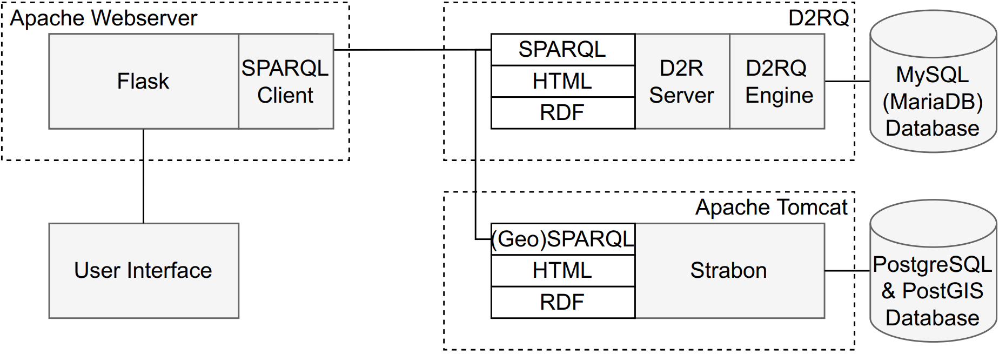
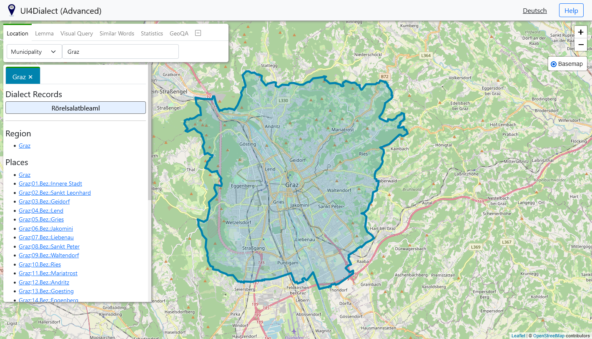
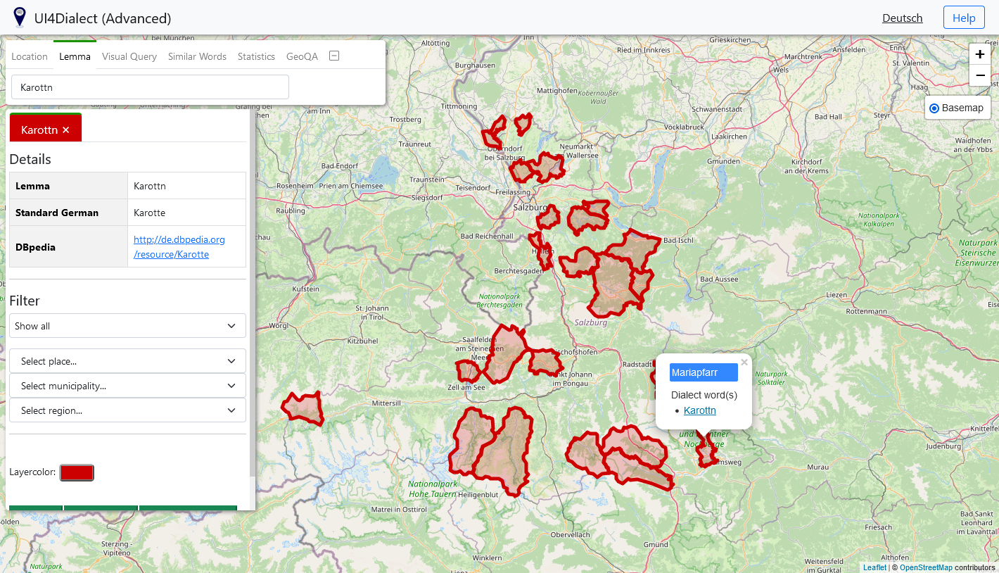
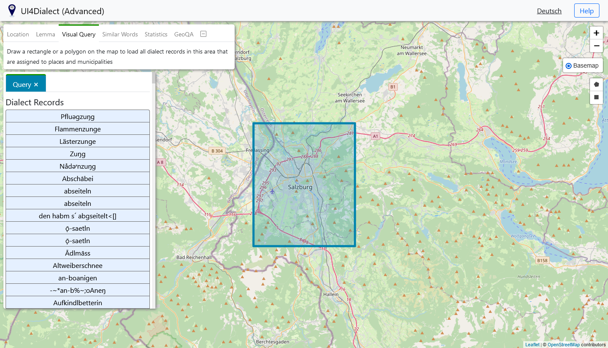
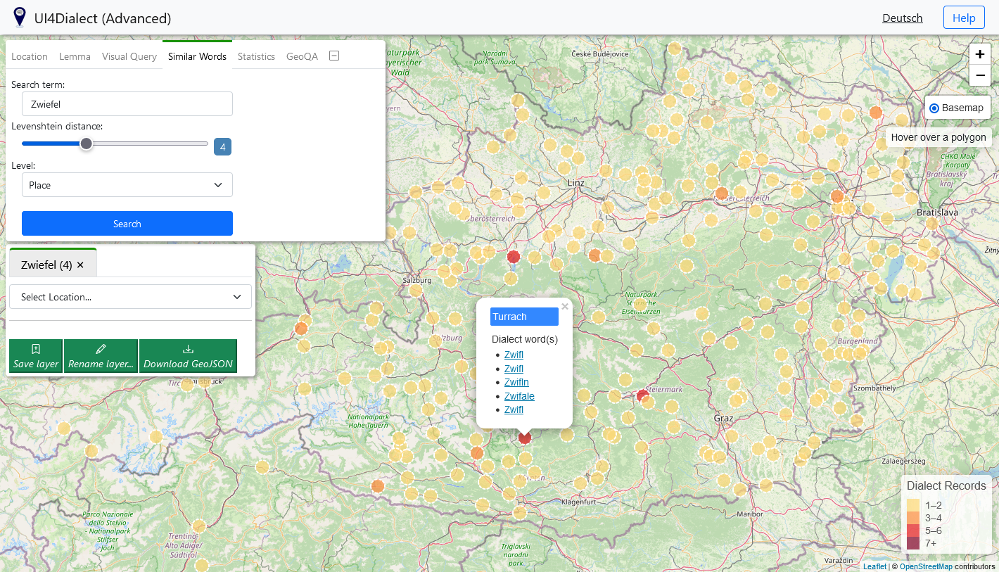
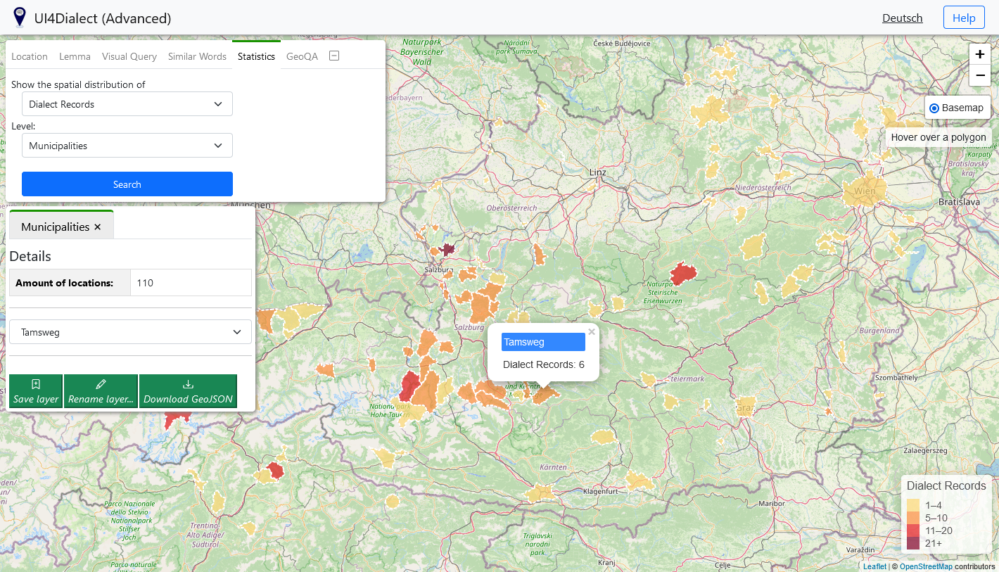
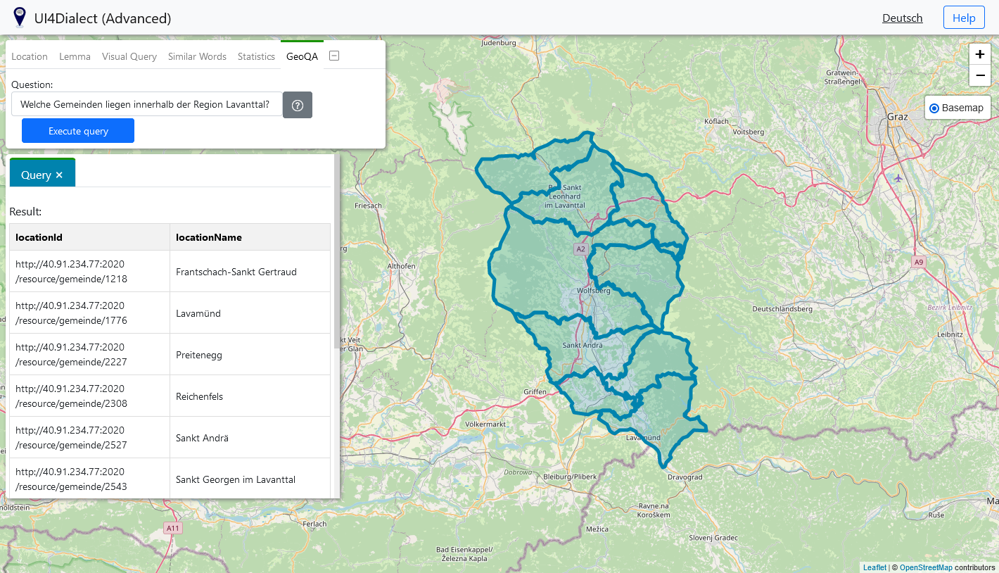

# UI4Dialect
MSc Thesis: "Development of a User Interface for an existing spatial Linked Data Approach for Dialect Data" @geowei1

## Abstract
Digitizing dialect data collections and storing them in a database is an important step towards making them more easily accessible both to linguistic experts and to the public. An example of this is the project “Database of Bavarian Dialects in Austria electronically mapped” (dbo@ema). In order to link data from this relational database with linguistic data from other databases and to be able to guarantee interoperability between them, a spatio-temporal Linked Data model based on the dialect data of the dbo@ema was recently created.

In this master's thesis, the development of a prototypical user interface for this existing Linked Data approach is presented. By providing various search methods, the user interface can be used to query data via a spatio-temporal SPARQL endpoint. Another key feature of the application is the implementation of a geographic question answering system. Such a system allows users to ask a question in natural language, whereupon the system tries to analyze the question and to answer it accordingly using data from the available data sources.

## Goals 
The goal of this project is to visualize spatio-temporal linguistic Linked Data from the dataset and to make interrelationships between the data easier to understand by applying techniques from the fields of Computer Science and GIScience. Furthermore, it is expected to make it easier for users to explore data from the database.

## System Architecture

## User Interface
### Location-Based Search
The user can search for a location, the application queries data from the database associated with this location.

### Lemma-Based Search
The user can search for a lemma, the application queries data from the database associated with this lemma.

### Visual Query
The Visual Query allows to query dialect records from a self-defined area.

### Spatial Distribution of Similar Dialect Words
Displays the spatial distribution of dialect words that are similar to each other.

### Spatial Distribution of Dialect Data
Provides information about the spatial distribution of dialect records.

### GeoQA System
The GeoQA System can be used to answer questions stated in natural language by the user.

